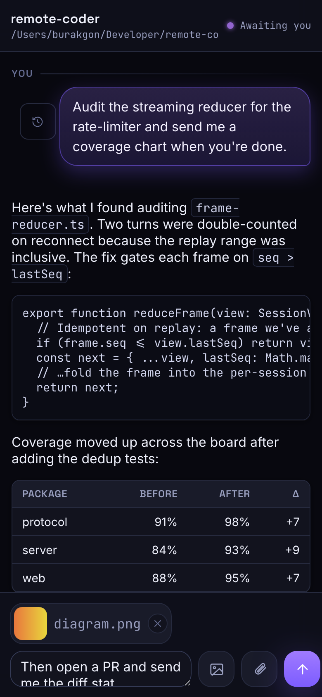
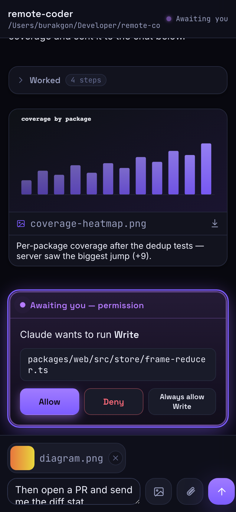
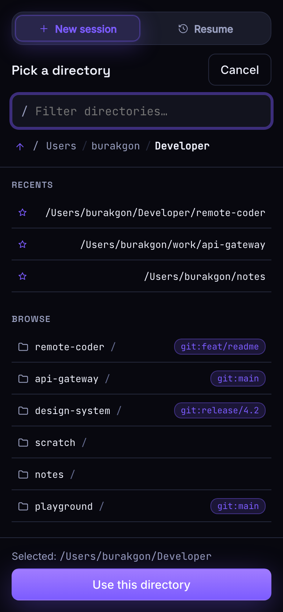
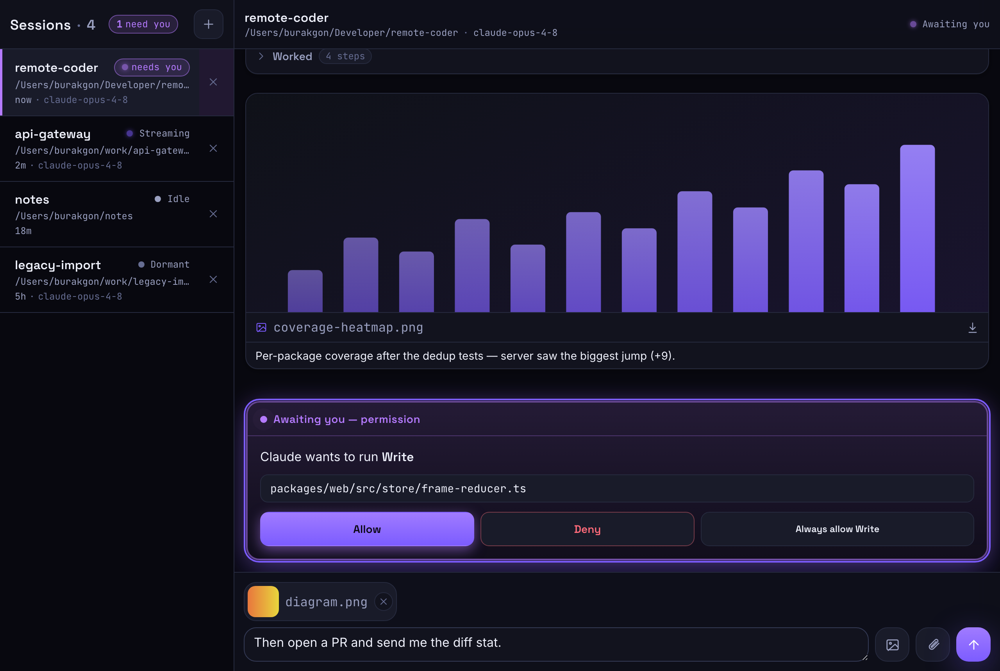
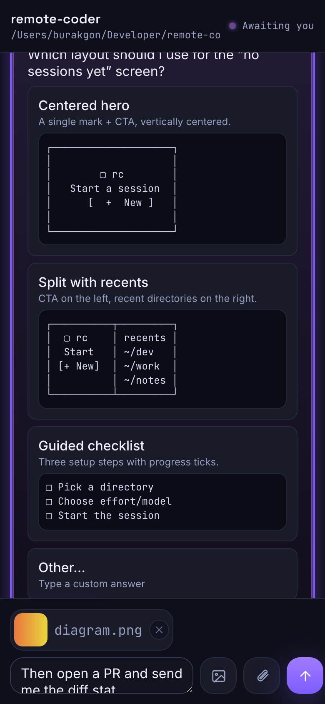
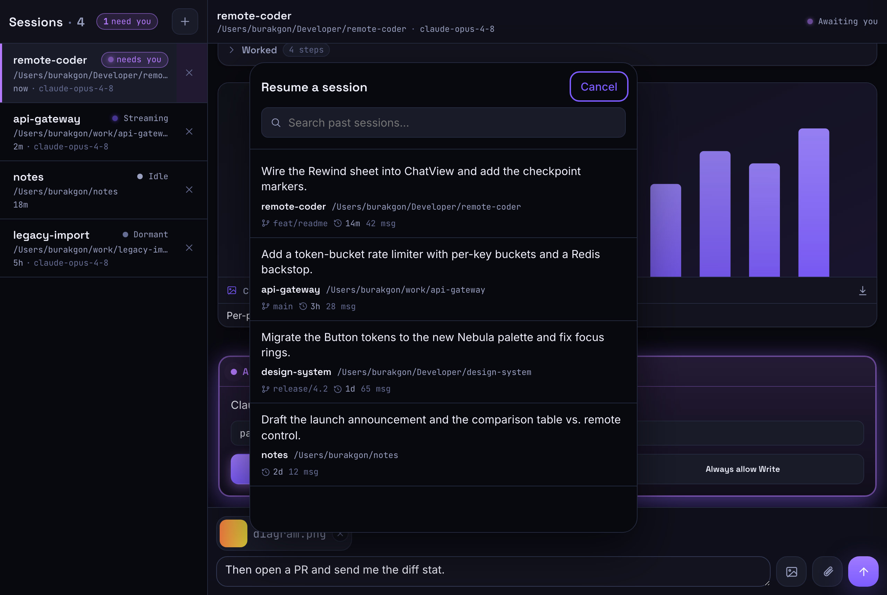
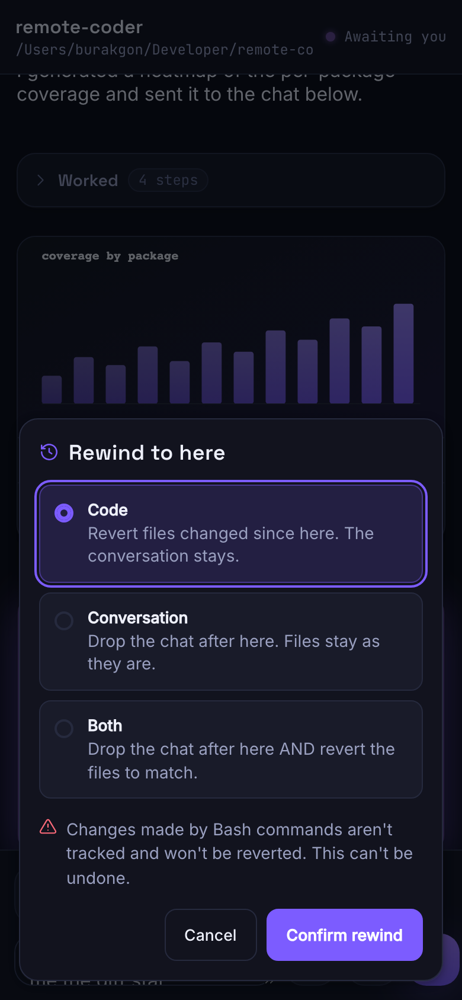
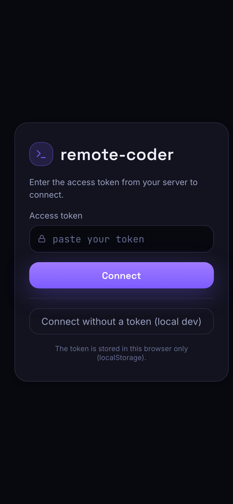

<div align="center">

# remote-coder

### Run and operate Claude Code on your own machine — fully remotely, from your phone or any browser.

A self-hosted server + installable PWA that lets you **start a brand-new Claude Code session from anywhere** and answer every interactive prompt — permissions, questions, file handoffs — without ever touching the terminal it runs in.

[](LICENSE)
[](#contributing)


<br/>


&nbsp;&nbsp;


</div>

---

remote-coder runs an always-on daemon on your dev machine. It drives the **real `claude` CLI** as a subprocess — using your Claude **subscription** (no API key, no Agent SDK) — and gives you a polished, installable web app with the things a terminal can't do from your pocket: streaming chat with markdown, **answerable** permission and question prompts, file handoff both ways, multi-session management, resume, stop, and rewind.

It is **host-native by design** (not containerized): your machine, your files, your `~/.claude`. It is **secure-by-default** (a mandatory access token) and **MIT** licensed.

## Why — the wedge

Anthropic ships first-party remote control (`claude remote-control`) and chat channels (Telegram/Discord). They share one hard limitation: **you can only resume sessions that were already started *at the machine*** — you can't spin up a new session remotely — and the chat channels **can't answer terminal permission prompts**.

remote-coder closes exactly that gap:

- **Start a new session from scratch, remotely** — pick a directory on your phone through a first-class, git-aware picker, and go.
- **Answer every interactive prompt remotely** — approve/deny tool use, pick from multiple-choice questions, all from the app.
- **The daemon keeps working if your phone disconnects** — reconnect and the conversation catches up from the replay buffer and the on-disk transcript.

|  | `claude remote-control` | Chat channels | **remote-coder** |
|---|:---:|:---:|:---:|
| Start a **new** session remotely | No (resume only) | No | **Yes** |
| Answer permission prompts remotely | n/a | No | **Yes** |
| Answer multiple-choice questions remotely | n/a | partial | **Yes** |
| Claude sends you files / images inline | No | Telegram-only | **Yes** |
| Installable responsive PWA | — | — | **Yes** |
| Self-host · MIT | No | varies | **Yes** |

## Features

### Remote control of real sessions

Start a session anywhere. The directory picker is the headline surface — git-aware (it shows the branch), with recents, breadcrumb navigation, a fuzzy filter, and thumb-reachable tap targets. The session rail tracks every session at a glance: live status, activity-sorted, with a loud **"needs you"** badge when a session is waiting on you.

<div align="center">

&nbsp;&nbsp;

</div>

### Interactive prompts you can actually answer

When Claude needs permission to run a tool, you get an **iris "Awaiting you" card** — Allow, Deny, or Always-allow-this-tool — answerable from your phone. Visibly destructive commands (`rm -rf`, `sudo`, `curl | sh`) are flagged in red.

When Claude asks a multiple-choice question (via a built-in `ask_user` MCP tool), you get a real question card: single- or multi-select, an **"Other…"** free-text option, and an **ASCII / code preview** per choice so you can *see* the options before you pick.

<div align="center">

</div>

### Files both ways

Upload images and files into a session. Browse, upload, and download host files (rooted at `FS_ROOT`). And **Claude can send files and images straight to your chat** — ask it to *"send me that chart"* and it appears inline (images preview; other files become a download). This uses a built-in MCP `send_image` / `send_file` tool — the same mechanism Anthropic's Telegram plugin uses — wired into every session with no extra setup.

### Sessions, resume, stop, rewind

Run multiple sessions concurrently. **Resume** any past conversation — from the rail, the wizard, or the in-chat `/resume` — replayed from its on-disk transcript. **Stop** a running turn mid-flight. **Rewind** to a checkpoint: revert the code, rewind the conversation, or both — the tappable equivalent of Claude Code's `Esc Esc`.

<div align="center">

&nbsp;&nbsp;

</div>

### A design that earns the screen

A dark **"Nebula"** (violet) theme, an installable PWA (Add to Home Screen, no app store), and **Web Push** when a session finishes or needs you. Model + effort switching and a per-session `--dangerously-skip-permissions` toggle are first-class controls.

<div align="center">

</div>

## Quickstart

Requires Node ≥ 20, [pnpm](https://pnpm.io/), and a machine **already logged into `claude`** (run `claude` once locally to authenticate — remote-coder has no remote login flow; see [Honest limitations](#honest-limitations)).

```bash
git clone <this-repo> && cd remote-coder
pnpm install
pnpm build
node packages/cli/dist/index.js
```

On first run it generates an access token, stores it in the data dir (mode `0600`), and prints a ready-to-use direct link:

```
remote-coder is running.
  Open: http://127.0.0.1:4280
  Access token generated and stored in the data dir. Open this link to connect:
    http://127.0.0.1:4280/?token=<long-random-token>

  For remote access put this behind an HTTPS tunnel (see the README).
```

Open that link on the same machine, then read [Remote access](#remote-access-from-your-phone) to reach it from your phone.

> **Note:** `npx remote-coder` is **not published yet** — the CLI package is `private` while the monorepo stabilizes. The supported path today is clone → build → run, above.

<details>
<summary>Useful flags &amp; environment variables</summary>

Run `node packages/cli/dist/index.js --help` for the full list.

- `--port <n>` — listen port (default `4280`; `0` = pick a free port). Sets `PORT`.
- `--bind <addr>` — bind address (default `127.0.0.1`). Sets `BIND_ADDRESS`. Use `0.0.0.0` **only** behind a secure tunnel.
- `--no-token` — loopback dev only: run without an access token. Sets `NO_TOKEN=1`. Never for public binds.

| Var | Default | Purpose |
|---|---|---|
| `PORT` | `4280` | Listen port (`0` = OS-chosen). |
| `BIND_ADDRESS` | `127.0.0.1` | Bind address. Keep loopback; use a tunnel for remote. |
| `ACCESS_TOKEN` | _(generated)_ | Override the generated/persisted token (used verbatim, never written to disk). |
| `NO_TOKEN` | _(unset)_ | `1` = loopback dev only: run tokenless. Never for public binds. |
| `FS_ROOT` | `$HOME` | Confine the file picker / fs endpoints to a subtree. |
| `MAX_UPLOAD_BYTES` | `26214400` | Upload size cap (25 MiB). |
| `REMOTE_CODER_DATA_DIR` | `~/.config/remote-coder` | SQLite DBs, token, VAPID keys (mode 0700). |
| `WEB_DIR` | _(auto)_ | Override the built-PWA directory served at `/`. |
| `VAPID_SUBJECT` | `mailto:remote-coder@localhost` | VAPID contact for Web Push. |
| `TRUST_PROXY` | `false` | Honor `X-Forwarded-For` behind a reverse proxy (`1`/`true`). |

</details>

## Remote access from your phone

remote-coder binds to `127.0.0.1` by default. **Do not expose the port directly.** The installable PWA and Web Push both require a **secure context (HTTPS)** — loopback counts as secure for same-machine dev, but any remote origin must be HTTPS. So put a tunnel in front of it while the server stays on your host. The access token is still required on every request and WebSocket through the tunnel.

**Cloudflare Tunnel (recommended).** With the server running on `127.0.0.1:4280`, in a second terminal:

```bash
cloudflared tunnel --url http://127.0.0.1:4280
```

It prints an `https://<random>.trycloudflare.com` URL. On your phone: open it, enter the token (or open the `…/?token=<token>` form to skip the prompt), "Add to Home Screen" to install the PWA, and enable notifications in Settings.

**Tailscale.** Join your phone + host to your tailnet, then use **Tailscale Serve** for an HTTPS hostname (needed for Web Push):

```bash
tailscale serve --bg http://127.0.0.1:4280
```

## Run it as a background service

```bash
node packages/cli/dist/index.js install
```

This **writes** a per-user service unit and **prints** the exact command to load it — it does not auto-enable anything, so you opt in explicitly. It runs as **you** (driving your real `claude`, files, and `~/.claude`); it is **not** a root/system daemon, and no secret is embedded in the unit (the token is read from the data dir at runtime).

- **macOS** — a launchd **LaunchAgent** at `~/Library/LaunchAgents/com.remote-coder.plist`:
  ```bash
  launchctl load -w ~/Library/LaunchAgents/com.remote-coder.plist     # start now + at login
  launchctl unload -w ~/Library/LaunchAgents/com.remote-coder.plist   # stop
  ```
- **Linux** — a `systemd --user` unit at `~/.config/systemd/user/remote-coder.service`:
  ```bash
  systemctl --user daemon-reload
  systemctl --user enable --now remote-coder    # start now + at login
  loginctl enable-linger "$USER"                # keep it running without an active login session
  ```

Uninstall (prints the removal commands): `node packages/cli/dist/index.js uninstall`. Windows has no service template — run `remote-coder` manually there.

### The login-session reality (be honest)

Claude's subscription auth must run in a **real login session** — that's why macOS uses a **LaunchAgent** (it runs as the logged-in user with access to your `~/.claude` credentials), not a system LaunchDaemon. The practical consequence: **on macOS the service only runs while that user is logged in.** There is no headless, pre-login auto-start equivalent to Linux's `enable-linger`. If you need it up across reboots on a headless Mac, you'll need to arrange an auto-login / persistent login session yourself; remote-coder does not do that for you.

## Security &amp; threat model

By design, remote-coder is **remote code execution on your host** — that *is* the feature. Treat it accordingly.

- **Mandatory access token.** Generated on first run (32 bytes CSPRNG, base64url), required on every HTTP request **and** WebSocket. Verified in **constant time** (`crypto.timingSafeEqual`), with a **per-client lockout** after repeated failures and generic `401`s. **If you bind to a non-loopback address with no token, the server refuses to start.**
- **Treat the token like an SSH key.** Anyone with the token + URL can drive *your* `claude`, with *your* permissions and *your* files. Don't paste it into chat logs, screenshots, or shared terminals.
- **HTTPS for anything non-local.** A public port without TLS leaks the token in transit. Use a tunnel. Loopback is the only place plain HTTP is acceptable.
- **The permission gate still applies.** Tool use prompts for approval — you approve/deny from your phone. `--dangerously-skip-permissions` is **per-session, off by default**, and surfaced as dangerous: it disables that gate (real, unattended RCE).
- **Restrict the file surface (optional).** Set `FS_ROOT=/path` to confine the directory picker + file endpoints to a subtree. It does **not** sandbox the `claude` subprocess itself.
- **Single-user.** One token, one user. Multi-user / RBAC, OIDC/SSO, and built-in sandboxing are **not** implemented (see below).
- **Treat the host as semi-disposable.** It runs your real shell tools as you. The `claude` CLI refuses to run as root — a backstop, not a sandbox.
- **Behind a reverse proxy**, set `TRUST_PROXY=1` so the lockout keys on the real client IP (`X-Forwarded-For`).

## Architecture

A pnpm-workspace monorepo, full TypeScript:

- **`packages/protocol`** — pure parse/serialize for Claude's stream-json + control protocol (the reverse-engineered wire format, locked by golden fixtures). No I/O.
- **`packages/server`** — Fastify: REST + per-session WebSocket + `/push`, the global token auth gate, the `claude` subprocess session manager, SQLite stores, and serving the built PWA at `/`.
- **`packages/web`** — the React PWA (chat, permission/question answering, the directory picker, rewind, settings, service worker + Web Push).
- **`packages/cli`** — the `remote-coder` binary (serve + `install`/`uninstall`).

Each session is a single long-lived `claude` subprocess driven over stream-json (NDJSON) on stdin/stdout — the same primitive the Agent SDK wraps, used directly so it runs on your subscription with **no API key and no SDK dependency**. Remote permissions ride a `PreToolUse` hook registered in the `initialize` handshake. See [`docs/protocol-notes.md`](docs/protocol-notes.md) and [`docs/superpowers/`](docs/superpowers/) for the full design.

## Honest limitations

remote-coder does a lot, but it is young. What it does **not** do yet:

- **No `npx remote-coder`** — the CLI is `private`/unpublished; clone + build is the path today.
- **No remote login** — the host must already be logged into `claude`. If auth expires, you re-authenticate **at the host**.
- **macOS service runs only while you're logged in** (login-session requirement; see above). No headless auto-start.
- **Single-user only** — no multi-user, RBAC, OIDC/SSO.
- **No built-in sandbox** — the `claude` subprocess has your full machine access; `FS_ROOT` only scopes the file endpoints, not the subprocess.
- **Deferred niceties:** free-text answers for the built-in `AskUserQuestion` path (the `ask_user` MCP path supports "Other…" today), per-session cumulative cost summation, and a timed idle-reaper are still on the roadmap.
- **Web Push** requires HTTPS and is opt-in only (never auto-prompted); the real-PushManager path is verified manually, not unit-tested.
- **Durability** uses `better-sqlite3`; if the native module can't build, the server still boots but persistence falls back to in-memory (not durable across restarts).

## FAQ

<details>
<summary><b>Does it need an Anthropic API key?</b></summary>

No. It drives the local `claude` CLI, which uses your machine's stored **subscription** OAuth credentials. `ANTHROPIC_API_KEY` is not used and not needed.
</details>

<details>
<summary><b>Why not Docker by default?</b></summary>

remote-coder is host-native on purpose: it drives your real `claude` binary, your real project files, and your real `~/.claude` subscription credentials. A container is isolated from exactly those things, which breaks the core use-case. If you insist on a container it must run non-isolated (`--network host` + bind-mounts of your home, `~/.claude`, and the data dir) — which removes most of Docker's benefit and is effectively running on the host. There is no supported image.
</details>

<details>
<summary><b>How does "Claude sends me a file" work?</b></summary>

A built-in MCP server (`send_image` / `send_file`) is wired into every session. Ask Claude to send you something; it calls the tool, the file is validated against `FS_ROOT`, and it lands in your chat over the same token-gated path as the file picker. In default permission mode Claude asks first (you approve from your phone); a `--dangerously-skip-permissions` session sends with no prompt.
</details>

<details>
<summary><b>What happens if my phone disconnects mid-task?</b></summary>

The daemon keeps running the task. On reconnect the app catches up via a per-session replay buffer plus the on-disk transcript — a known weak spot of the alternatives.
</details>

<details>
<summary><b>Can I limit which files it can touch?</b></summary>

Set `FS_ROOT` to confine the directory picker and the browse/upload/download endpoints to a subtree. Note this scopes the **file endpoints**, not the `claude` subprocess, which still runs with your full permissions.
</details>

## Contributing

PRs and issues are welcome. The project is full-TypeScript with `eslint` + `prettier` and a `vitest` suite (unit + a mock-`claude` integration path; live `claude` tests are opt-in and excluded from CI).

```bash
pnpm install
pnpm build
pnpm typecheck
pnpm lint
pnpm test
```

The screenshots in this README are captured from the **real shipped components** by a harness in `packages/web/src/screenshot/` — `pnpm -C packages/web build:shot && node packages/web/scripts/app-screenshot.mjs` rebuilds them into `docs/screenshots/`.

## License

[MIT](LICENSE).
